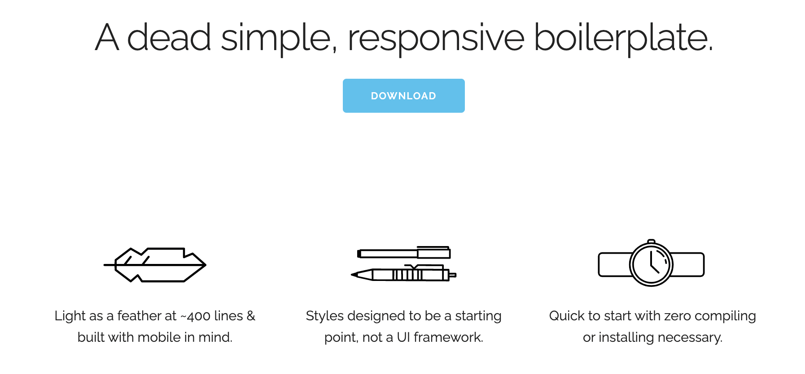
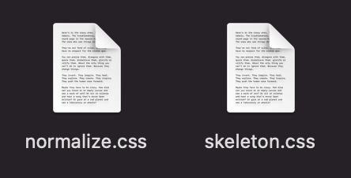
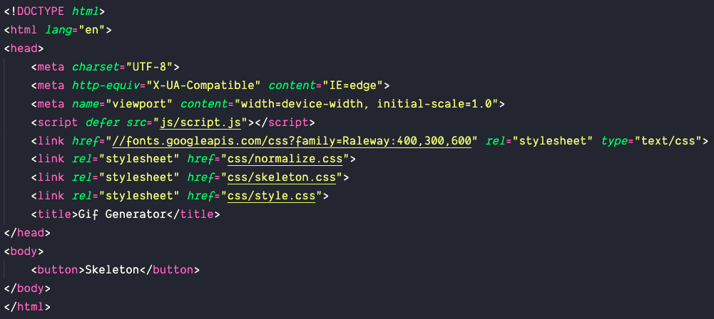
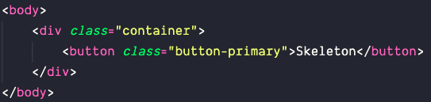
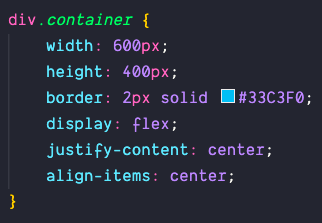
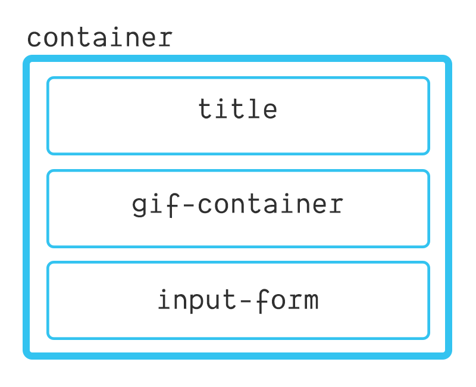
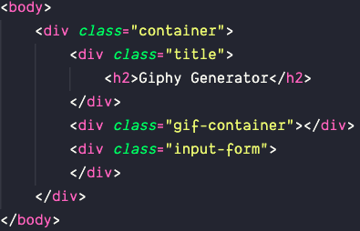
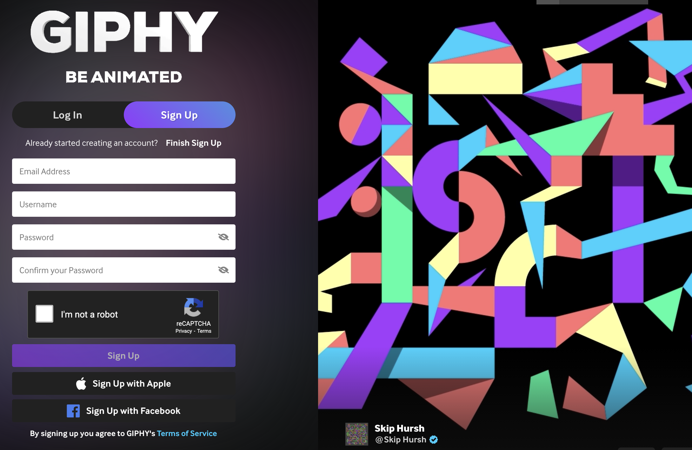
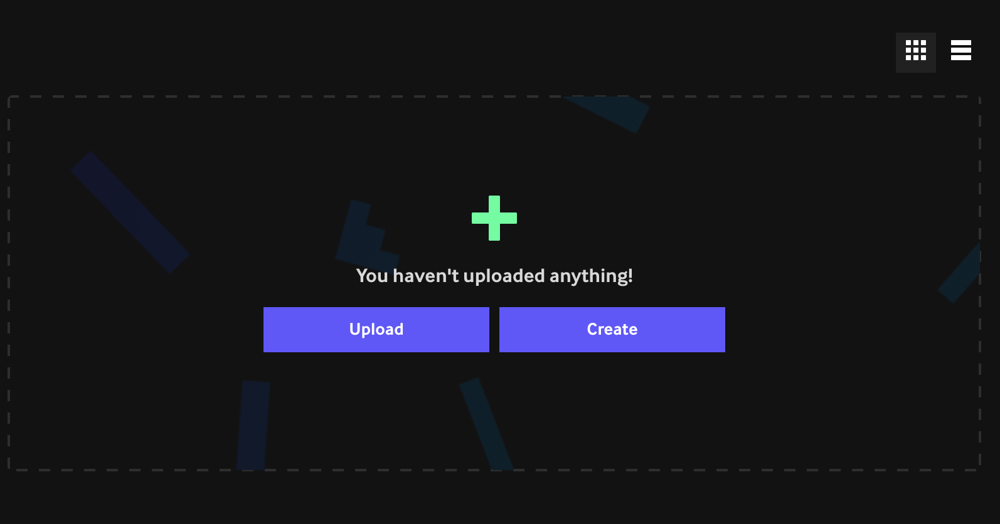

# jQuery Giphy Generator

<br>
<br>


## Intro

Let's build a lightweight gif generator using the Giphy API, jQuery, and skeleton!

<br>
<br>


## Set Up

Create a new directory, then type the following into the console: 

```
mkdir js && touch js/script.js
mkdir css && touch css/style.css
touch index.html
```

Stub up your basic html boilerplate (! + tab), and connect the JavaScript and CSS files (don't forget to defer the JS script).
Change the title to "Gif Generator"

You're ready to go! 🚀

<br>
<br>

## Part 1: Skeleton 

## 1.1 Init



Skeleton bills itself as "a dead simple, responsive design". We can use it to quickly add a polished look to a small project! 

Why Skeleton? It's lightweight, easy to use, and there's zero installing or compiling required to get it up and running. 
It doesn't have the large number of components that frameworks like Bootstrap provide, but it does provide some useful tools!

Sold? Let's get it hooked up!

When you download Skeleton, you'll notice it has two folders and an html file. If you like, you can use the html file provided by Skeleton as a starting page - it will have the CSS and FavIcon already set up, along with some initial styling! This can be a nice way to hit the ground running with a new project. 

We're going to start from scratch, however! Let's open up the CSS folder and see what's inside: 



`normalize.css` is essentially a CSS reset, that helps us deal with common brower inconsistencies. It also helps to prevent us from relying on browser default styling! normalize helps set a dependable structure for our other file: 

`skeleton.css` 💀 
This file contains the actual styling being applied to our page via predefined classes. We can use those classes to mark up our HTML! 

We're going to take both files and drop them into our css folder. Next, we need to connect them! We'll want to put them on top of our `style.css` file, so that we can override any styles we wish to later on. 

One final thing - Skeleton uses the Railway font by default! Lets add that above our style links! 

```html
<link href="//fonts.googleapis.com/css?family=Raleway:400,300,600" rel="stylesheet" type="text/css">
```


Our link order should look like this 

## 1.2 Sanity Check!

Did it work? 👀

Let's test it out. Within the body of your HTML page, lets add a button:
```html
<body>
    <button>Skeleton</button>
</body>
```

Look at that styling! Mouse over the button to see a nice minimal `:hover` effect! You'll also notice that the button is pushed RIGHT up against the top and left side of the screen. That's our normalizer file in action! 

We have access to two main button classes with Skeleton, standard, and the `.button-primary` class. Let's try adding that class to our button. 

Nice! Now we know we're running Skeleton, and also how to make outlined and primary buttons! 

## 1.3 Layout pt.1

We're feeling good - only problem is that we'd love for our cool new button to be centered on the screen. We'll also need a spot for our gif to go! Let's make a container div for both to live in, and center it! 

Remember, we can use emmet notation to make our lives easier! 

`.container` + tab will give us: 

```html
<div class="container"></div>
```

Let's put our button inside the div! 



Next, let's add some styling: 

```css
html, body {
    height:100%;
  }

body {
    display: flex;
    justify-content: center;
    align-items: center;
}

div.container {
    width: 600px;
    height: 400px;
    border: 2px solid #33C3F0;
}
```

We're selecting both the html and the body with comma seperation, and setting the height to 100% - this allows us to vertically center our container in the next step. Our normalize.css file is setting the margin of our body to 0, so we don't have to include that here. If you aren't using a css reset, make sure to give html and body `margin:0` to avoid a scrollbar and some overflow. 

Next, we make the body a flexbox and horizontally and vertically center it's contents (our container)

Finally, we just give our container some dimensions, and give it a border so we can see it! We'll remove that border later on, but it can be helpful while styling to get visual feedback.

If we want to move our button itself to the center of the container, we'll need to give our container a property of `display: flex` as well. The flex container only wraps around it's immediete children, so there is no grandchild+ inheritance at play. 



Everything is centered!

## 1.4 Layout pt.2

Let's move back over to our HTML, and build out the basic structure for our container! 

Here's how our container will be organized: 



Let's get started from the top. We'll add a new `div` with a class of 'title', and inside of that we'll create an `h2` and give our page a title. How about 'Giphy Generator'? 

Below our title `div`, we want to add a recepticle for the gif we'll eventually be returning! Let's create a `div` and give it a class of 'gif-container'

Finally, we're going to create a container for our input form. Same as above, we'll make a new `div` and give it a class of 'input-form'.

Progress check! Your code should look like this: 


Let's add some more styling

```css
div.container {
    width: 600px;
    height: 450px;
    border: 2px solid #33C3F0;
        /* Add below: */
    display: flex;
    justify-content: space-around;
    align-items: center;
    flex-direction: column;
}
```
We'll make the container a flex, then give our container class `flex-direction:column` so that the items flow top to bottom vs. the default row's left to right. 
Then we'll use `justify-content: space-around` to give even spacing around each of our divs. Because we've changed the flex-direction to column, justify-content will target the vertical axis instead of the horizontal axis, which is default. 


## 1.5 Skeleton Grid 

Skeleton comes with a 12-column fluid grid that can mostly be handled in the HTML using classes. We'll be using it to stub up a pretty simple input form, but know that it can be used for a lot more! 

[More info on grid](http://getskeleton.com/#grid)

First, we'll create a form, then inside of that we'll create a `div` with the class of 'row'.
This creates a grid row. Inside of that row, we want to create two columns - one for our input, and one for the form's submit button. Skeleton uses the following class convention for columns:

```html
<div class="row">
    <div class="<numberword> + <column(s)>"> </div>
    <div class="<numberword> + <column(s)>"> </div>
</div>
```

The total number of columns will equal 12! So, to make our input roughly 2/3s of the row, we can put: 
```html
<div class="row">
    <div class="nine columns"> </div>
    <div class="three columns"> </div>
</div>
```
Great! We have some columns. Let's go ahead and add an input to the first one. 

```html
 <input class="u-full-width" type="text" value="" placeholder="Search Giphy">
```
The class "u-full-width" comes from skeleton, and makes the input take up the full available space it's given. We give the input a type of "text" as and a placeholder value. We also want to give it a value set to an empty string - we'll be needing this later once we want to use the value of what the user inputs! 

Now we have an input, and we need a way to submit the data it's prepared to receive! In our second column, let's put the button we made earlier! 

```html
<button class="button-primary" type="submit">Search</button>
```
We'll rename it to something more semantic - Skeleton doesn't really help the user know what it does, after all. We can keep our 'button-primary' class, but we'll add `type="submit"`. Now, the button inside our form will try to submit form data (the inputs value) on click! 

Finally, lets add some styling!

```css
div.title {
    margin-top: 2.5rem;
}

div.gif-container {
    height: 200px;
    width: 50%;
    background-color: lightgray;
    margin-bottom: 1rem;
}

div.input-form {
    margin-right: 4rem;
}
```
Looking good 😎 

# Part 2: The Giphy API

## 2.1 Signing Up



For this app we'll be using the Giphy API! If you already have a Giphy API key, you can skip this step!

[https://developers.giphy.com/](https://developers.giphy.com/)

Click "Create An App", then select "Sign Up". After you put in an email and password, Giphy will send you an email to authenticate the account. Follow the instructions there, and you should be greeted by a screen like this: 



Now, we're need to go back to the [API page](https://developers.giphy.com/docs/sdk/)

At the top right of the screen, next to the dropdown menu, click the "Create An App" button. On the following screen, it will ask you to select between the SDK and the API options. 

Select API (it's more than enough for what we need) and click next. It will ask you for an App name and description, put what you like here and click next! 

Now, at long last, you'll be granted an API key! Let's open up our script.js, and assign our API key to a variable. 

```javascript
const API_KEY = '<your api key here as a string>'
```

Great, now we've got that for when the time comes to use it! 

Before we move into making an API call, let's go ahead and examine what our endpoint will look like! Thankfully, Giphy has excellent documentation. From the top nav, let's select "Docs".

There's a lot to read through here, for today we're going to skip ahead and find the Search Endpoint. Giphy API -> API Endpoints -> Search Endpoint. 

This endpoint will allow us to take input from the user and enter it as a search query. It requires a query string and an API key, and allows for an optional parameter which sets a limit to the results we get back.

Since we'll be using this same starting address for all of our calls, we can go ahead and save it to a variable as our base url, in script.js:

```javascript
const BASE_URL = 'https://api.giphy.com/v1/gifs/search'
```

Per the docs: 

```
The search keyword should be sent to GIPHY in &q parameter in the API call.
```

So, we could build out an API call like so:

```javascript
`${BASE_URL}?q=mysearchquery&api_key=${API_KEY}`
```

Whatever we manually type after `q=` will be the search term that Gihpy uses to return data to us! 

❗Hold up, what is that '?' doing in there? 
The ? mark indicates the end of the URL resource path and the start of query parameters. We'll be specifying the results we want using numerous query parameters- the first of which is our search term. 

‼️ Ok, hold up again. Why does api_key have a `&` in front of it? 
The & mark is used for chaining parameters - hence why our first query parameter, the search keyword, doesn't have one. Each subsequent query parameter will have one in front of it. 

What's next? Now we need to plug in our input so that whatever the user submits can dynamically update our API request. For that, we'll use jQuery, so we're going to pivot to getting that part of our APP built out next. Let's comment out our URL (for now) and get started on tying everything together!


## Part 3: $jQuery

At long last, let's add jQuery to our index.html! 

```html
<script src="https://code.jquery.com/jquery-3.3.1.min.js"></script>
```

Now is a good time to stop and consider what aspects of the DOM we need access to in our JavaScript file. 

We'll need to call a function when the user submits data.
We'll need the value of that input.
And we'll need a target for our return value - aka an `img` tag we can dynamically update the `src` of. 

```javascript
const $input = $('input')
const $form = $('form')
const $img = $('img')
```

For bigger apps with multiple inputs or forms, we'd want to be more specific- however for a small app like this, we can just use element selectors. 


<br>
<br>


## Bonus

